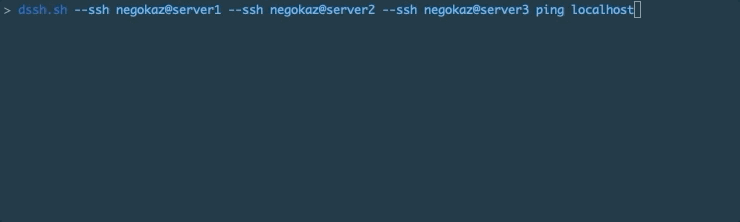

# dssh.sh

ssh client script for distributed systems



## Requirements

- bash
- ssh

## Install

Place `dssh.sh` to a directory which definition in `PATH` environment variable.

```
curl -L https://raw.githubusercontent.com/negokaz/dssh.sh/master/dssh.sh \
    -o /usr/local/bin/dssh.sh
chmod +x /usr/local/bin/dssh.sh
```

## Usage

### Watch log being in destination servers

```
dssh.sh --ssh user@26.10.10.10 --ssh user@26.10.10.11 tail -F /var/log/messages
```

### Watch log with destination file

```
dssh.sh -f ssh.dests tail -F /var/log/messages
```

### Collect ERROR logs on server and sort they on localhost

```
dssh.sh -f ssh.dests --no-label bash -c 'cat /var/log/messages | grep ERROR' | sort | less -R
```

### Publish a file to destination servers

```
cat source.txt | dssh.sh -f ssh.dests --silent tee /tmp/dest.txt
```

### Fetch files from destination servers

```
dssh.sh -f ssh.dests -o out -a messages.log --silent cat /var/log/messages
```

## License

Copyright (c) 2019 Kazuki Negoro

dssh.sh is released under the [MIT License](./LICENSE)